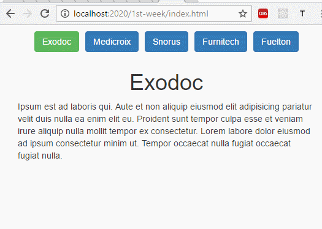

# Reto de la 1ra. semana

Para ponernos a tono y practicar con conceptos de Javascript vainilla, se propone,
utilizando el archivo menu.json, construir un pequeño sitio web utilizando los datos
que allí se encuentran.

Dicho archivo JSON es un arreglo de objetos que contienen las siguientes propiedades:

* id: un número único que identifica la sección
* isActive: indica si la seccion está (o debe ser) mostrada en éste momento
* picture: ruta a una imagen que identifica la sección
* name: nombre de la sección
* content: contenido de la sección

Las reglas son:

* No se puede utilizar ninguna librería externa salvo el CSS de bootstrap
* No se puede tocar la estructura del HTML que ya está creada, salvo para agregar mas scripts

Se cuenta con un archivo index.html que representa nuestro sitio web, un styles.css en el cual
podemos agregar estilos si así lo deseamos y un index.js como punto de entrada para comenzar a programar.

Para levantar un servidor y trabajar, primero haber corrido *npm install* en la raíz de éste repositorio
luego de ésto, tenemos dos opciones:

* Correr *gulp server* y acceder a nuestro espacio de trabajo en [http://localhost:8000/1st-week/index.html]
* Correr *node server.js* y acceder por el enlace [http://localhost:2020/1st-week/index.html]

El comando *npm start*, ejecuta la accion *gulp server*